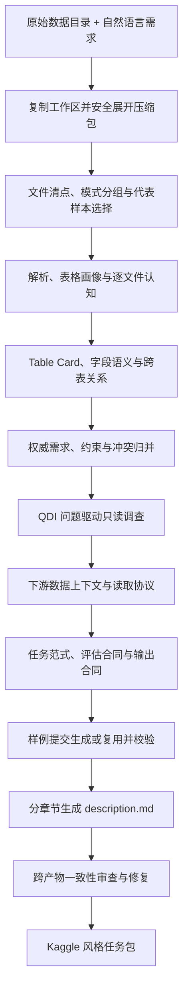

# AutoRealize

[](LICENSE)
[](https://www.python.org/)

AutoRealize 将**原始数据目录 + 自然语言需求**转换成一份可以直接交给算法工程师、AutoML Agent 或搜索系统使用的 **Kaggle 风格赛题包**。

它不只是总结文件。AutoRealize 会核对数据怎么读取、表和字段如何关联、任务究竟属于预测/优化/决策/RL 中的哪一类、指标如何计算、结果必须输出成什么格式，并把这些结论同时写成人类可读文档和机器可执行合同。

最终产物的核心是：

- `description.md`：完整的 Kaggle 风格任务书；
- `sample_submission.csv`：复用官方样例，或按输出合同生成并校验的样例；
- `realize_report/automl_context.md`：供下游 AutoML/Agent 直接阅读的精确上下文；
- `realize_report/automl_context_pack.json`：对应的机器可读合同；
- `realize_report/main_task_protocol.json`：任务事实、数据访问、评估和输出合同的统一入口；
- `realize_report/`：数据认知、调查、审查、运行轨迹及 LLM 用量等可追溯材料。

> AutoRealize 负责把数据和需求“实现”为完备赛题，不负责训练最终模型。模型训练、搜索和交付可以由任意下游系统消费上述任务包。

## 工作流程



各步骤不是清一色调用 LLM，而是按证据类型选择规则、LLM 或混合流程：

| 步骤            | 做什么                                                            | 怎么做                                                                                                                                                    |
| --------------- | ----------------------------------------------------------------- | --------------------------------------------------------------------------------------------------------------------------------------------------------- |
| 1. 工作区准备   | 保留原始输入，建立独立运行目录                                    | **规则**：复制输入；按配置展开压缩包；输入已有 `description.md` 时备份为 `description_origin.md`                                                |
| 2. 文件选择     | 避免大量同构文件把上下文撑爆                                      | **规则 + LLM**：按文件名、目录、表头和 schema 签名分组；规则先抽代表文件，可选 LLM 仅提出分组正则，候选仍需程序验证                                 |
| 3. 解析与画像   | 获得精确物理 schema 和数据质量事实                                | **规则**：解析文件、识别 CSV 方言和 Excel 布局；统计 shape、列名、类型、空值、唯一值、类别、数值与日期特征；大表按配置采样                          |
| 4. 文件认知     | 判断每个文件的角色、字段含义和风险                                | **混合**：程序事实作为不可覆盖的底座，LLM 总结业务语义、关键实体和读取注意事项；结果按文件写入 artifact                                             |
| 5. 关系发现     | 找出训练/预测/说明/提交文件及跨表关系                             | **规则为主**：字段名、值域交集、覆盖率和基数验证一对一/一对多/多对多关系；不会仅凭名称相似断言字段等价                                              |
| 6. 权威信息归并 | 解决用户要求、原始任务文档和数据推断之间的优先级                  | **混合**：提取权威需求和约束，保留冲突与未决问题；物理文件和字段回到真实 schema 校验                                                                |
| 7. QDI 调查     | 针对“表头在哪、主外键是否成立、指标/输出是否明确”等缺口继续取证 | **LLM 规划 + 受限规则执行**：LLM 选择只读工具或编写受限 Python 探查脚本；程序限制动作、超时和输出，再由 LLM 根据结果决定追问、修复脚本或结束        |
| 8. 下游上下文   | 明确训练表、预测表、ID、目标列、sheet 和读取参数                  | **规则 + 受约束 LLM 消歧**：先生成真实候选；只有低置信度维度交给 LLM 选择，返回结果必须属于候选并通过 schema 回验                                   |
| 9. 任务协议     | 建模预测、时序、推荐、静态优化、决策、RL 或混合任务               | **LLM + 结构化校验**：生成范式协议、评价公式、方向、边界条件及输出合同；Pydantic/规则检查结构和引用                                                 |
| 10. 样例输出    | 给下游提供确定的提交/决策结果格式                                 | **混合**：优先复制官方 `sample_submission`；否则 LLM 生成构造脚本，程序在运行副本中执行并验证列名、顺序、行数和来源字段                           |
| 11. 任务书生成  | 形成可读、可执行的 Kaggle 风格说明                                | **LLM 分章节生成**：任务概述、任务定义、评估协议、输出格式、数据说明、关键字段、约束/防泄漏和待确认事项分别生成，已确认章节被冻结，避免全文反复改写 |
| 12. 一致性审查  | 防止说明文档、评估合同、样例输出和 AutoML 上下文互相矛盾          | **LLM 审查 + 定向修复 + 规则复验**：修复器只能改被点名的章节；不存在的文件/字段引用、合同结构和样例格式由程序再次检查                               |

## 支持的输入

| 类型       | 后缀                                                                                                | 说明                                                      |
| ---------- | --------------------------------------------------------------------------------------------------- | --------------------------------------------------------- |
| 表格       | `.csv`, `.xlsx`, `.xls`                                                                       | CSV 编码/分隔符推断；Excel 多 sheet、非首行表头和布局证据 |
| 结构化数据 | `.json`, `.toml`                                                                                | JSON 可展开嵌套结构；TOML 提取结构化摘要                  |
| 文本       | `.txt`, `.md`, `.rst`, `.log`                                                               | 按`utf-8`、`utf-8-sig`、`gb18030` 等候选编码读取    |
| 文档       | `.docx`, `.pdf`                                                                                 | DOCX 提取段落和表格；PDF 提取文本层。扫描 PDF 不内置 OCR  |
| 图片       | `.png`, `.jpg`, `.jpeg`, `.bmp`, `.gif`, `.webp`, `.tif`, `.tiff`                   | 始终可读取图片元数据；配置视觉模型后可做语义认知          |
| 压缩包     | `.zip`, `.rar`, `.tar`, `.tar.gz`, `.tgz`, `.tar.bz2`, `.tbz2`, `.tar.xz`, `.txz` | 在运行副本中展开，原始输入目录不被修改                    |

未注册格式会保留在最终任务目录中，但只标记为未知二进制文件，不做深度解析。

## 环境要求

- Conda、Miniconda 或 Miniforge；
- **Python 3.12**；
- 可访问的 OpenAI-compatible 文本模型 API；
- 输入目录读取权限和输出目录写入权限；
- 可选：OpenAI-compatible 视觉模型 API，用于图片语义认知。

项目目前从仓库根目录直接运行，不需要 `pip install -e .`。请始终在含有 `autorealize/` 和 `config/` 的 AutoRealize 根目录执行命令。

## 使用 Conda 安装

### 1. 克隆仓库

```bash
git clone https://github.com/DonaLdZY/AutoRealize.git
cd AutoRealize
```

### 2. 创建 Python 3.12 环境

```bash
conda create -n autodecision python=3.12 pip -y
conda activate autodecision
python -m pip install --upgrade pip
python -m pip install -r requirements.txt
```

验证环境：

```bash
python --version
python -c "import autorealize; print(autorealize.__file__)"
```

第一条命令应输出 `Python 3.12.x`，第二条应指向当前仓库中的 `autorealize/__init__.py`。

开发和测试还需要：

```bash
python -m pip install -r requirements-dev.txt
```

## 配置模型

默认配置位于 [`config/config.yaml`](config/config.yaml)。建议生成一份仓库外的私有配置，而不是把 API Key 写进受 Git 管理的默认文件。

Linux / macOS：

```bash
mkdir -p "$HOME/.config/autorealize"
python -m autorealize.cli --write-default-config "$HOME/.config/autorealize/config.yaml"
export DEEPSEEK_API_KEY="your_api_key"
```

Windows PowerShell：

```powershell
New-Item -ItemType Directory -Force "$HOME\.autorealize" | Out-Null
python -m autorealize.cli --write-default-config "$HOME\.autorealize\config.yaml"
$env:DEEPSEEK_API_KEY = "your_api_key"
```

`llm.api_key` 非空时配置文件中的值优先；为 `null` 时读取 `DEEPSEEK_API_KEY`。这个环境变量名也用于其他 OpenAI-compatible 文本模型服务。

### DeepSeek

默认配置已经使用 DeepSeek 兼容接口：

```yaml
llm:
  base_url: "https://api.deepseek.com"
  model_name: "deepseek-v4-pro"  # 请改成你的账号实际可用模型
  api_key: null
  enable_thinking: null
  reasoning_effort: null
  max_concurrent_requests: 4
```

对于名称以 `deepseek` 开头且使用官方地址的模型，客户端会把官方根地址归一化到 `/beta`，以兼容 Chat Prefix Completion；普通 Chat Completions 仍通过同一客户端调用。thinking、`reasoning_effort`、JSON mode、缓存 token 和结构化输出长度失败也有 DeepSeek 专用适配及降级重试。

### 其他 OpenAI-compatible Provider

只需在私有 YAML 中替换地址和模型名：

```yaml
llm:
  base_url: "https://your-provider.example/v1"
  model_name: "your-model"
  api_key: null
  max_concurrent_requests: 4
  prompt_cache_key_mode: "auto"
```

`prompt_cache_key_mode: auto` 只会向 OpenAI 官方端点发送 OpenAI 专属的 `prompt_cache_key`；其他 provider 不会收到该字段。若兼容服务拒绝可选 thinking/cache 参数，客户端会移除对应参数后重试。

### 可选视觉模型

默认配置开启图片语义认知，并从 `AUTOREALIZE_VISION_API_KEY` 或 `VLLM_API_KEY` 读取 Key：

```powershell
$env:AUTOREALIZE_VISION_API_KEY = "your_vision_api_key"
```

对应配置：

```yaml
vllm:
  enabled: true
  base_url: "https://your-vision-provider.example/v1"
  model_name: "your-vision-model"
  api_key: null
  fail_silently: true
```

不需要图片语义或没有视觉模型时，显式关闭它：

```yaml
vllm:
  enabled: false
```

### 最重要的运行参数

完整配置带有中英双语注释，可运行 `python -m autorealize.cli --print-default-config` 查看。以下参数最影响时间、费用或结果：

| 配置                                                     | 影响                                                                         |
| -------------------------------------------------------- | ---------------------------------------------------------------------------- |
| `llm.max_concurrent_requests`                          | 文本模型并发上限。先用`4`；provider 限流宽松时再提高                       |
| `parallel.cognition_max_workers`                       | 文件解析/认知 worker 数；同时受 LLM 并发上限约束                             |
| `parallel.relations_max_workers`                       | 跨表关系分析并发                                                             |
| `parallel.probe_max_workers`                           | QDI 探查动作并发                                                             |
| `data.llm_file_cognition_mode`                         | `all` 最充分；`documents_only` 更省；`none` 仅做规则认知               |
| `data.table_profile_sample_rows`                       | 单表画像最大行数；设为`null` 才会允许全量读取                              |
| `investigation.trigger_mode`                           | `always` 全面调查；`on_demand` 只在存在阻断缺口时启动；`disabled` 关闭 |
| `investigation.max_questions` / `max_rounds_per_run` | QDI 问题数和每题动作预算，直接影响耗时与 token                               |
| `switches.generate_sample_submission`                  | 是否生成/复用并验证`sample_submission.csv`                                 |
| `prompt.output_language`                               | 最终自然语言：`zh`、`en` 或 `auto`                                     |
| `prompt.control_language`                              | LLM 控制指令语言：`zh` 或 `en`；原始证据和标识符保持原样                 |
| `context.cross_stage_headroom_ratio`                   | 输入上下文占比；其余空间留给模型输出和推理                                   |
| `context.cross_stage_memory_trigger_chars`             | 动态记忆达到该规模后触发压缩                                                 |

仓库默认并发值面向高吞吐环境。个人 API 账号建议先将 `llm.max_concurrent_requests` 和三个 `parallel.*_workers` 调到 `4` 至 `8`，确认没有 429/超时后再增加。

## CLI 使用

### 最小示例

Linux / macOS：

```bash
python -m autorealize.cli \
  --config "$HOME/.config/autorealize/config.yaml" \
  --input-root "/path/to/raw-task" \
  --output-root "/path/to/runs" \
  --run-name "sales-forecast" \
  --task "根据历史订单预测未来 30 天每个商品的销量；以 MAE 评价，输出商品 ID 和预测销量。"
```

Windows PowerShell：

```powershell
python -m autorealize.cli `
  --config "$HOME\.autorealize\config.yaml" `
  --input-root "D:\data\raw-task" `
  --output-root "D:\data\runs" `
  --run-name "sales-forecast" `
  --task "根据历史订单预测未来 30 天每个商品的销量；以 MAE 评价，输出商品 ID 和预测销量。"
```

结果写入 `<output-root>/<run-name>/`。`--task` 可以为空，但任务目标、硬约束、指标和输出要求写得越明确，系统越少依赖推断。

### 常用覆盖参数

```text
--no-cognition                 跳过数据认知
--no-task-definition           跳过任务定义
--no-knowledge                 关闭本地知识库
--no-telemetry                 关闭事件和状态文件
--no-llm-cache                 关闭本地 LLM 响应缓存
--llm-timeout SECONDS          覆盖请求超时
--llm-concurrency N            覆盖 LLM 并发
--cognition-workers N          覆盖文件认知 worker 数
--auto-generate-predict-split  在运行副本中生成预测演练切分
```

完整参数以实际 CLI 为准：

```bash
python -m autorealize.cli --help
```

`--auto-generate-predict-split` 只适合缺少独立预测集、又需要演练预测流程的任务。它会修改本次运行的输入副本，不会修改原始输入目录。

## Python API

```python
from pathlib import Path

from autorealize import AutoRealizeConfig, AutoRealizePipeline

config = AutoRealizeConfig.from_file(Path.home() / ".config/autorealize/config.yaml")
pipeline = AutoRealizePipeline(config)

run_dir = pipeline.run(
    input_root=Path("/path/to/raw-task"),
    output_root=Path("/path/to/runs"),
    task_hint="预测未来 30 天销量，并按 MAE 评价。",
    run_name="sales-forecast",
)
print(run_dir)
```

Windows 可将配置路径改成 `Path.home() / ".autorealize/config.yaml"`。

## FastAPI 服务

在 AutoRealize 仓库根目录启动：

```bash
conda activate autodecision
python -m uvicorn autorealize.service_api:app --host 127.0.0.1 --port 18101
```

交互式 OpenAPI 页面：`http://127.0.0.1:18101/docs`。

### 启动任务

```bash
curl -X POST "http://127.0.0.1:18101/jobs/start" \
  -H "Content-Type: application/json" \
  -d '{
    "task_id": "sales-forecast",
    "input_root": "/absolute/path/to/raw-task",
    "output_root": "/absolute/path/to/runs",
    "run_name": "sales-forecast",
    "task_hint": "预测未来 30 天销量，并按 MAE 评价。",
    "config_path": "/absolute/path/to/private-config.yaml",
    "python_executable": "python",
    "working_dir": "/absolute/path/to/AutoRealize",
    "auto_generate_predict_split": false
  }'
```

`working_dir` 应明确设为 AutoRealize 仓库根目录；`config_path` 建议使用绝对路径。服务会在后台子进程中执行与 CLI 相同的 pipeline，并返回 `job_id`。

### 查询、停止和读取快照

```bash
# 查询任务状态
curl "http://127.0.0.1:18101/jobs/<job_id>"

# 停止任务
curl -X POST "http://127.0.0.1:18101/jobs/stop" \
  -H "Content-Type: application/json" \
  -d '{"job_id":"<job_id>"}'

# 汇总前端所需的状态、事件和产物
curl -X POST "http://127.0.0.1:18101/snapshot" \
  -H "Content-Type: application/json" \
  -d '{"run_dir":"/absolute/path/to/runs/sales-forecast"}'
```

接口清单：

| 方法     | 路径               | 用途                                         |
| -------- | ------------------ | -------------------------------------------- |
| `GET`  | `/health`        | 健康检查                                     |
| `POST` | `/jobs/start`    | 启动一个 AutoRealize 子进程                  |
| `GET`  | `/jobs/{job_id}` | 查询状态以及 stdout/stderr 尾部              |
| `POST` | `/jobs/stop`     | 请求停止任务，超时后强制终止                 |
| `POST` | `/snapshot`      | 读取一次运行的状态、事件、报告和文件认知索引 |

任务状态保存在服务进程内存中；服务重启后旧 `job_id` 不再可查，但已经落盘的运行目录仍可通过 `/snapshot` 读取。

## 输出目录

AutoRealize 先在 `<run-dir>/data/` 处理输入副本，完成后把数据文件平铺回运行根目录。因此最终目录通常是：

```text
<output-root>/<run-name>/
|-- <输入数据文件和目录的副本>
|-- description.md
|-- description_origin.md                 # 输入原本含 description.md 时生成
|-- sample_submission.csv                 # 任务需要且成功生成/复用时存在
`-- realize_report/
    |-- original_requirements.txt
    |-- data_description.md
    |-- data_cognition_report.json
    |-- file_cognition/
    |-- authoritative_task_memory.json
    |-- constraint_memory.json
    |-- question_investigation_report.json
    |-- data_access_protocol.json
    |-- problem_paradigm_report.json
    |-- description_protocol_bundle.json
    |-- evaluation_contract_report.json
    |-- submission_report.json
    |-- automl_context.md
    |-- automl_context_pack.json
    |-- main_task_protocol.json
    |-- artifact_consistency_report.json   # 启用并执行一致性审查时存在
    |-- frontend_manifest.json
    |-- current_state.json
    |-- event_stream.jsonl
    |-- llm_traces.jsonl
    |-- llm_usage.jsonl
    |-- llm_usage_summary.json
    `-- artifacts/
```

下游系统推荐按以下优先级消费：

1. `main_task_protocol.json`：统一机器入口；
2. `automl_context_pack.json`：数据访问、字段、约束、评估和输出的结构化上下文；
3. `automl_context.md`：适合与desciption拼接直接放入 Agent 上下文；
4. `description.md`：供人阅读，也可作为 Kaggle 风格任务说明。

## License

Copyright 2026 Bydecision.

本项目采用 [Apache License 2.0](LICENSE)。你可以在许可证条款下使用、修改和分发本项目；再分发时需保留许可证及相关版权/NOTICE 声明，并遵守 Apache-2.0 的专利和商标条款。
